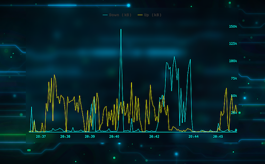

# tsushin (通信)
Übersicht widget : Dynamically updating line chart that shows total up and down data being transferred to your Mac in kB. Heavily inspired by the work of Dion Munk -  network-throughput

Regular version - tsushin.widget (400px x 250px)


Smaller version - tsushin_small.widget (200px x 50px) 


(Thanks to the feedback from [Porco-Rosso](https://github.com/Porco-Rosso))

## How to use:
Just copy tsushin.widget folder to your Widgets Folder. _Please let me know if you get error that says .bash_profile does not exists._
To move the widget around modify the numbers in the style section in the tsushin.coffee file:
```
top: 10.6%
left: 10%
```

## Regular and smaller versions included
There are two versions included. The regular version, tsushin.widget, has 400 px width and 250 px height by default. The smaller version has 200 px width and 50 px height by default. When scaling down the regular version below certain size it did not scale down properly. Smaller version has also adjusted font size and line width to match its scale.

You can still change the size of the chart area to your liking. To do so, modify the values of width and heights in the following code block in the `render` section:
`<div id="container" style="width:400px; height:250px;"></div>`

## How to read the graph:
Yellow line indicates the total amount of uploaded data at the given time.
Blue line then is for the total of downloaded data at the given time.

## Note:
This should work out of box just by placing tsushin.widget or tsushin_small.widget folder in your Widgets Folder. However if you entcounter any error, please let me know.

In case you want to know what tsushin means, it means communication in Japanese.

## Todo:
- review README.md and improve

Happy coding
