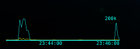

# tsushin (通信)
Übersicht widget : Dynamically updating line chart that shows total up and down data being transferred to your Mac in kB. Heavily inspired by the work of Dion Munk -  network-throughput

 Of course you might want to know what tsushin means in case you haven't studied Japanese before, it means communication.

## How to use:
Just copy tsushin.widget folder to your Widgets Folder. _Please let me know if you get error that says .bash_profile does not exists._
To move the widget around modify the numbers in the style section in the tsushin.coffee file:
```
top: 10.6%
left: 10%
```

To change the size of the chart area, modify the values of width and heights in the following code block in the `render` section:
`<div id="container" style="width:400px; height:250px;"></div>`

## How to read the graph:
Yellow line indicates the total amount of uploaded data at the given time.
Blue line then is for the total of downloaded data at the given time.

## Note:
This should work out of box just by placing tsushin.widget folder in your Widgets Folder. However if you entcounter any error, please let me know.

## Update:
Thanks to the feedbacks from @Porco-Rosso, there is now a smaller version in the tsuchin_small.widget. It can for instance be placed in the bottom or top of your screen among other widgets to make a visual status bar. 



Happy coding
