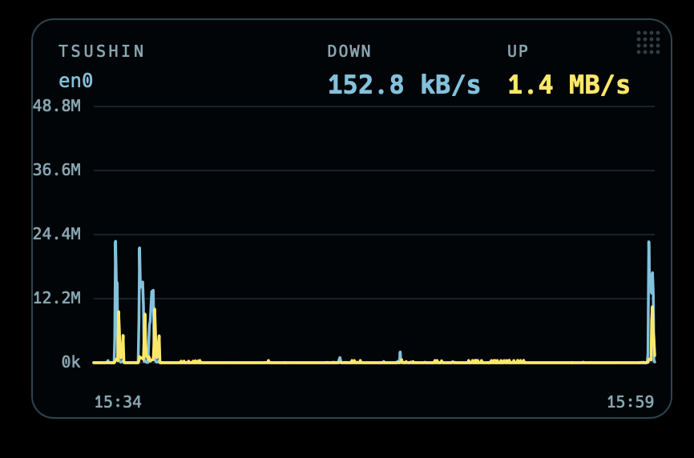
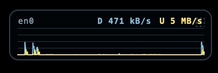
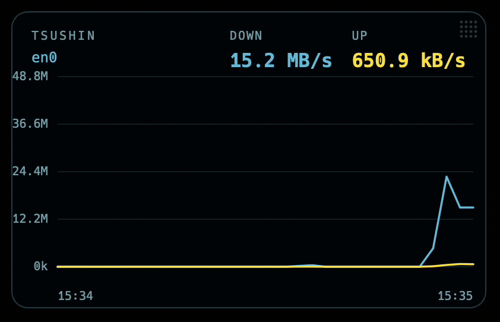
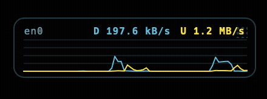

# tsushin (通信)

`tsushin` is an [Übersicht](https://tracesof.net/uebersicht/) widget that shows live network throughput on macOS.

It samples the active network interface, calculates download and upload throughput in `kB/s`, and renders a bounded rolling chart so the graph stays responsive over long runtimes.

> This repo was overhauled in 2026 with heavy assistance from [Claude Code](https://claude.com/claude-code) — see [2026 overhaul](#2026-overhaul) below for what changed and how it was built.

Regular widget:



Small widget:



Animated previews:





## What is included

- `tsushin.widget`: regular version, default size `400 x 250`
- `tsushin_small.widget`: compact version, default size `200 x 50`
- `scripts/install-widgets.mjs` (via `pnpm run deploy`): installs one or both generated widgets into your local Übersicht widgets folder
- `src/`: TypeScript source used to generate the shipped `.jsx` widgets

## Features

- Rolling 1-hour graph window
- Automatic active-interface detection
- Download and upload lines rendered locally with SVG
- No external chart library or CDN dependency
- Drag-to-reposition: grab the grip handle in the corner to move the widget on screen
- Local `config.json` file for simple on-screen positioning
- Shared TypeScript implementation for both widget sizes

## Install

From this repo:

```bash
pnpm run deploy
```

That installs the regular widget into the default Übersicht widgets folder if it can be detected.

Other options (pnpm requires `--` before extra arguments so they are forwarded to the script instead of being parsed by pnpm itself):

```bash
pnpm run deploy -- small
pnpm run deploy -- both
pnpm run deploy -- regular "$HOME/Library/Application Support/Übersicht/widgets"
```

After installation, reload Übersicht or restart the app.

Typical widget location:

```text
~/Library/Application Support/Übersicht/widgets/
```

## Move the widget

Grab the small grip handle in the widget's top-right corner and drag it to reposition. The new position is written back to the widget's `config.json` automatically, so it persists across refreshes and reinstalls.

You can also position the widget by hand: edit the local `config.json` inside the installed widget folder.

Regular widget:

```text
~/Library/Application Support/Übersicht/widgets/tsushin.widget/config.json
```

Small widget:

```text
~/Library/Application Support/Übersicht/widgets/tsushin_small.widget/config.json
```

Example:

```json
{
  "left": "40px",
  "top": "80px"
}
```

`left`/`top` are written straight into CSS, so any valid CSS length works — not just `px` and `%`, but also `em`, `vw`/`vh`, `calc()`, etc.

The installer preserves your local `config.json` when you reinstall updated widget files.

## Adjust the graph's time window

`tsushin.widget` keeps a rolling window of recent samples and drops anything older, so the graph doesn't stall after long uptimes. By default it shows the last 60 minutes.

To change it, add `windowMinutes` to the widget's `config.json` (same file used for position, see above):

```json
{
  "windowMinutes": 120
}
```

This sets how many minutes of history the graph retains and displays — raise it to see longer-term trends, lower it for a more responsive, short-term view. Applies to `tsushin.widget` only; `tsushin_small.widget` doesn't have a scrolling graph.

## Read the graph

- Blue line: download throughput
- Yellow line: upload throughput

The widget scales the Y axis automatically based on recent traffic.

## Choose between regular and small

Use `tsushin.widget` if you want axis labels, time labels, and a larger chart area.

Use `tsushin_small.widget` if you want a compact status-style widget near an edge of the screen.

## Develop

The editable source is in `src/`. The checked-in `.widget` folders contain generated files for Übersicht.

Install dependencies:

```bash
pnpm install
```

Build generated widget output:

```bash
pnpm run build
```

Type-check only:

```bash
pnpm run typecheck
```

Reinstall locally after a rebuild:

```bash
pnpm run deploy -- regular
pnpm run deploy -- small
pnpm run deploy -- both
```

## Project layout

```text
src/
  entries/         widget-specific defaults
  shared/
    widget.tsx      shared TypeScript widget logic
    types.ts        shared type definitions
    tsushin.sh      shell sampler
  types/           TypeScript ambient type declarations (jsx.d.ts)
scripts/
  build-widgets.mjs
  install-widgets.mjs
tsushin.widget/
  tsushin.jsx      generated Übersicht entry
  config.json      local position override
  src/             generated shared runtime
  tsushin.sh       shell sampler
tsushin_small.widget/
  ...
```

## Customize beyond position

For size and default layout changes, edit:

- `src/entries/regular.tsx`
- `src/entries/small.tsx`

Then rebuild:

```bash
pnpm run build
```

For shared chart behavior, edit:

- `src/shared/widget.tsx`
- `src/shared/tsushin.sh`

## Package zip files

To rebuild both distributable zips:

```bash
pnpm run package
```

This runs the TypeScript build, regenerates both widget directories, and
zips `tsushin.widget/` and `tsushin_small.widget/` into
`tsushin.widget.zip` and `tsushin_small.widget.zip` at the repo root. Only
the known-good widget files (`assets/`, `src/`, `tsushin.jsx`, `tsushin.sh`,
`config.json`) are included, so local junk like `.DS_Store` or the
`.tsushin-state` runtime file never ends up in the zip.

If you only need to re-zip an already-built widget (no source changes),
run `pnpm run zip` instead.

## Troubleshooting

If the widget does not appear:

1. Make sure the widget folder exists under `~/Library/Application Support/Übersicht/widgets/`.
2. Reload Übersicht after installing.
3. Check that `tsushin.jsx`, `config.json`, `tsushin.sh`, and the `src/` folder are all present inside the installed widget directory.
4. If you changed source files in this repo, run `pnpm run build` before reinstalling.

If you want to start clean, delete the installed widget folder and run `pnpm run deploy` again.

## 2026 overhaul

`tsushin` started as a CoffeeScript Übersicht widget. In 2026 it was rewritten and modernized:

- Migrated from CoffeeScript to TypeScript/JSX, with a shared widget implementation compiled to both the regular and small variants
- Switched the package manager from npm to pnpm
- Added drag-to-reposition, with the dragged position persisted per widget and surviving reinstalls
- Replaced the old `deployReady_zip.sh`/`install.sh` shell scripts with `pnpm run package` and `pnpm run deploy`, so build/zip/install are one consistent pnpm-based pipeline
- Fixed a state-persistence bug where running both widgets at once could clobber each other's saved position
- Refreshed the screenshots, animated previews, and this README

This overhaul was done with heavy assistance from [Claude Code](https://claude.com/claude-code) — most of the migration, tooling rewrite, and bug fixes above were written, reviewed, and tested with it, which is how a change of this size came together in a short amount of time.

## Notes

`tsushin` means "communication" in Japanese.
